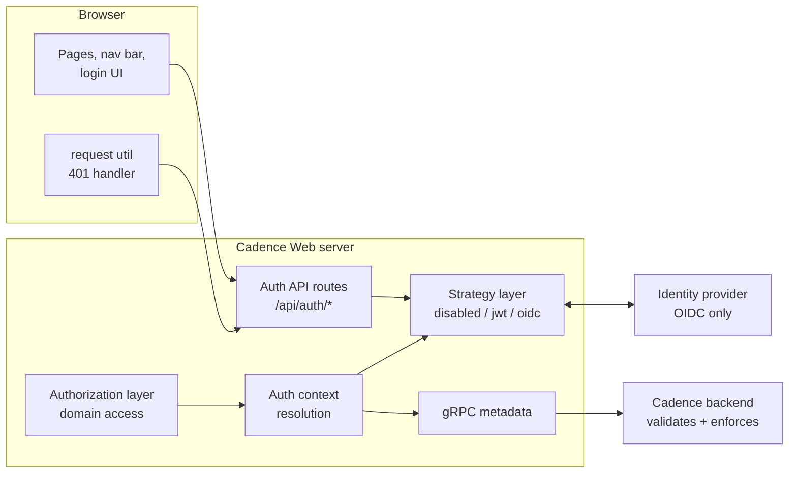
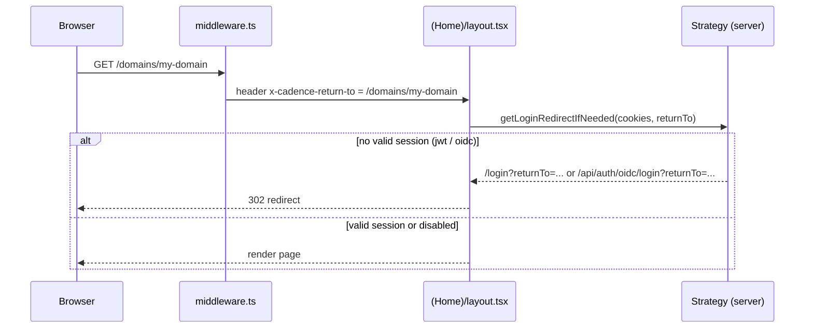
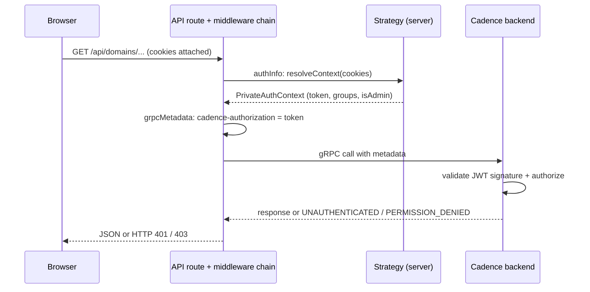
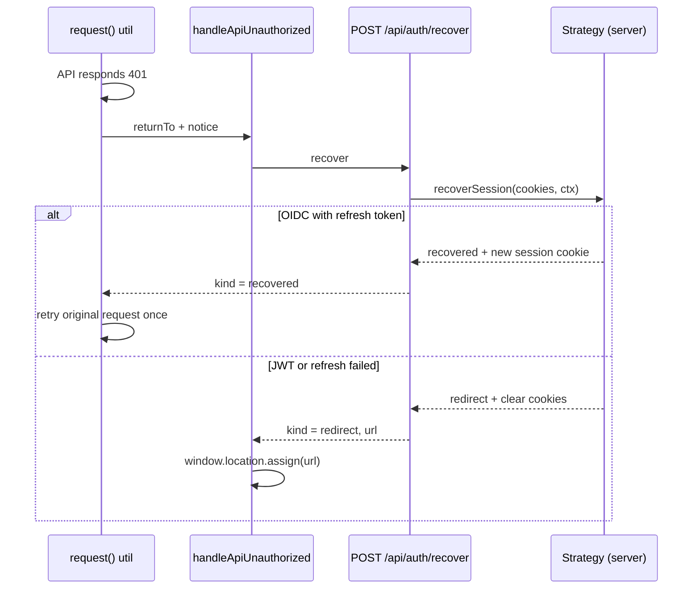

# Cadence Web Auth Module — Design Document

This document is the single entry point for understanding the goal, scope, design, security model, limitations, and usage of authentication and authorization in Cadence Web. It targets any software engineer, including those with minimal prior auth knowledge — unfamiliar terms are linked to external explanations throughout, and section 12 walks through the whole design in plain words.

The operator-focused quickstart (env vars, example claims, verification steps) lives in [`docs/auth.md`](./auth.md); this document covers the *design* and links back to it for setup details.

---

## Table of contents

1. [Goal and scope](#1-goal-and-scope)
2. [Design at a glance](#2-design-at-a-glance)
3. [Modules](#3-modules)
4. [Connections — how the modules talk to each other](#4-connections--how-the-modules-talk-to-each-other)
5. [User flows per strategy](#5-user-flows-per-strategy)
6. [Supported customizations](#6-supported-customizations)
7. [How to customize or add a new auth provider](#7-how-to-customize-or-add-a-new-auth-provider)
8. [Design rationale — why these approaches were taken](#8-design-rationale--why-these-approaches-were-taken)
9. [Security model and intentional leftovers](#9-security-model-and-intentional-leftovers)
10. [Backend change requirements](#10-backend-change-requirements)
11. [Migration — from web-side token processing to backend-driven auth](#11-migration--from-web-side-token-processing-to-backend-driven-auth)
12. [The design explained in detail (for readers new to auth)](#12-the-design-explained-in-detail-for-readers-new-to-auth)
13. [Configuration and usage reference](#13-configuration-and-usage-reference)
14. [Appendix — file index](#appendix--file-index)

---

## 1. Goal and scope

**Goal.** Let Cadence Web work with a Cadence backend that has authorization enabled: get a credential from the user (or an identity provider), attach it to every backend call, reflect the user's permissions in the UI, and handle session expiry gracefully.

**Explicit non-goals** (scope boundaries):

- Cadence Web is **not** an identity provider. It never issues credentials.
- Cadence Web is **not** the authorization authority. The [Cadence server](https://github.com/cadence-workflow/cadence) validates every token and enforces every permission on every [gRPC](https://grpc.io/docs/what-is-grpc/introduction/) call. Anything the web tier computes about permissions is a *UI hint* — it decides what to show, never what is allowed.
- Cadence Web does **not** verify token signatures. It decodes token payloads for display and routing decisions only (see [section 8](#8-design-rationale--why-these-approaches-were-taken) for why).

**The one-sentence contract:** the web tier obtains a token, stores it in an [HttpOnly cookie](https://developer.mozilla.org/en-US/docs/Web/HTTP/Guides/Cookies#block_access_to_your_cookies), forwards it to Cadence as [gRPC metadata](https://grpc.io/docs/guides/metadata/) under the key `cadence-authorization`, and mirrors the backend's authorization rules just enough to render a truthful UI.

---

## 2. Design at a glance

Auth behavior is selected by one environment variable, `CADENCE_WEB_AUTH_STRATEGY`, resolved once at server start:

| Strategy | What it means | Credential |
| --- | --- | --- |
| `disabled` (default) | No login. UI treats everyone as fully allowed; no token is sent to Cadence. | none |
| `jwt` | User pastes a pre-issued [JWT](https://jwt.io/introduction) on a login page. | Raw JWT in the `cadence-authorization` cookie |
| `oidc` | Cadence Web acts as an [OpenID Connect](https://openid.net/developers/how-connect-works/) relying party against any spec-compliant identity provider (Keycloak, Okta, Auth0, Entra ID, …). | Provider tokens inside an encrypted `cadence-oidc-session` cookie |

Everything else is built around a **strategy interface**: each strategy implements the same small set of server-side and client-side functions, and the rest of the app calls those functions without knowing which strategy is active.

---

## 3. Modules

The auth code is organized into seven modules. Paths are relative to `src/`.

### 3.1 Strategy layer — `utils/auth/strategies/`

The heart of the design. Each strategy provides two policies defined in `utils/auth/auth.types.ts`:

**Server policy** (`AuthServerPolicy`) — runs in Next.js server code:

| Function | Responsibility |
| --- | --- |
| `resolveContext(cookieStore)` | Read the session cookie and produce a `PrivateAuthContext`: token, validity, expiry, groups, admin flag, user identity. |
| `getLoginRedirectIfNeeded(cookieStore, returnTo)` | Decide whether an unauthenticated page request should be redirected, and where to. |
| `recoverSession(cookieStore, ctx)` | Try to silently extend an expired session (e.g. via a refresh token); return `recovered`, `redirect`, or `noop` plus cookie side effects. |

**Client policy** (`AuthClientPolicy`) — runs in the browser, registered in `utils/auth/client-auth-actions.ts`:

| Field | Responsibility |
| --- | --- |
| `supportsSessionRecovery` | Whether expiry-driven flows should attempt recovery before logging out. |
| `login(returnTo)` | Start the login flow (navigate to `/login` or the OIDC login endpoint). |
| `logout(notice, returnTo)` | End the session (clear cookie / RP-initiated logout). |
| `onUnauthorized(ctx)` | React to a 401 from the API (call the recover endpoint, follow redirects). |

Server strategies are picked by `utils/auth/strategies/resolve-auth-strategy.ts` — an exhaustive `switch` over the config value, so adding a strategy value without wiring an implementation is a compile error. The OIDC strategy is loaded with a dynamic `import()` so its dependencies stay out of deployments that don't use it.

### 3.2 Auth context — `utils/auth/auth-context.ts`

`resolveAuthContext()` asks the active strategy to turn cookies into a `PrivateAuthContext` (server-only: contains the raw token). `getPublicAuthContext()` projects it to an explicit allowlist — `authEnabled`, `isValidToken`, `expiresAtMs` — which is all the browser ever sees via `GET /api/auth/me`.

### 3.3 Server plumbing — `middleware.ts`, `app/(Home)/layout.tsx`, route-handler middleware

- `src/middleware.ts` does **not** enforce auth. It only stamps the current path into an `x-cadence-return-to` request header on page routes so the app knows where to send the user back after login.
- `src/app/(Home)/layout.tsx` is the actual login gate for pages: it calls the strategy's `getLoginRedirectIfNeeded()` and issues the redirect. The `/login` page lives *outside* the `(Home)` route group so it is reachable while logged out.
- API routes are guarded differently: the route-handler middleware chain (`utils/route-handlers-middleware/`) runs `authInfo` (resolve the context) → `grpcMetadata` (build the `cadence-authorization` header) → `grpcClusterMethods` (create authenticated gRPC clients). Unauthorized calls surface as HTTP 401/403 rather than redirects.

### 3.4 Auth API routes — `app/api/auth/**` and their route handlers

Thin HTTP wrappers over route handlers in `src/route-handlers/`:

| Route | Purpose |
| --- | --- |
| `GET /api/auth/me` | Public session snapshot (`authEnabled`, `isValidToken`, `expiresAtMs`, `authStrategy`). Never contains tokens or groups. |
| `GET /api/auth/user` | User display info (`id`, `userName`, `pictureUrl`). A designated **override point** (see [section 6](#6-supported-customizations)). |
| `POST /api/auth/token` / `DELETE` | JWT strategy: set / clear the `cadence-authorization` cookie. POST is guarded against cross-origin requests. |
| `GET /api/auth/oidc/login` | Start the OIDC flow: build the provider authorization URL, set the pending cookie, redirect. |
| `GET /api/auth/oidc/callback` | Finish the OIDC flow: exchange the code, verify, set the encrypted session cookie. |
| `GET /api/auth/oidc/logout` / `DELETE` | Clear the session; GET also performs [RP-Initiated Logout](https://openid.net/specs/openid-connect-rpinitiated-1_0.html) at the provider when supported. |
| `POST /api/auth/recover` | Strategy-aware session recovery. Returns `recovered`, `redirect`, or `noop`. |

### 3.5 Authorization layer — `utils/auth/authorization/`

Mirrors the Cadence OSS domain-permission model for UI purposes:

- `domain-access.ts` — computes `{ canRead, canWrite }` by matching the user's groups against the domain's `READ_GROUPS` / `WRITE_GROUPS` metadata. Admins and disabled auth get full access; domains with no group metadata are treated as open (the backend still decides).
- `domain-access-http.ts` — turns that into HTTP responses: 401 when there is no valid token, 403 when the token is valid but read access is denied.
- Two designated-override API routes expose it: `GET /api/domains/[domain]/[cluster]/access` (the current user's access) and `.../access-groups` (the domain's group lists).

### 3.6 Client-side auth UI — `components/app-nav-bar/`, `views/jwt-login-page/`, `views/domain-page/domain-page-access-gate/` etc.

- `useUserInfo` fetches `/api/auth/me` and seeds a client-side cache of the active strategy.
- `useAuthLifecycle` (nav bar) drives login/logout menu items, the session-expiry countdown, proactive recovery at expiry, and expiry snackbars.
- `JwtLoginPage` (`/login`) is the paste-a-token UI for the JWT strategy.
- `DomainPageAccessGate` renders an "Access denied" panel when the domain API returns 401/403; `DomainPageMetadataAuth` shows the user's access level and the domain's groups on the Metadata tab.
- Dynamic-config resolvers (`WORKFLOW_ACTIONS_ENABLED`, `SCHEDULE_ACTIONS_ENABLED`, `BATCH_ACTIONS_UI_ENABLED`) call the same `/access` API so action buttons match what the backend would allow.

### 3.7 Client request/recovery pipeline — `utils/request/request.ts`

Every browser API call goes through one `request()` util. On a 401 it calls `handleApiUnauthorized()`, which resolves the strategy's client policy and calls `POST /api/auth/recover`; if recovery succeeds the original request is retried exactly once. Recovery is skipped for auth-internal endpoints, deduplicated when concurrent requests fail together, and never attempted during server-side rendering.

---

## 4. Connections — how the modules talk to each other

### 4.1 Page request (server-rendered)

### 4.2 API request with gRPC call

gRPC status codes map to HTTP in `utils/grpc/grpc-error.ts` (`UNAUTHENTICATED` → 401, `PERMISSION_DENIED` → 403).

### 4.3 401 recovery loop (browser)

### 4.4 Data the browser can see

The browser never receives a raw token. It learns about auth from four endpoints, each an intentional seam:

| Endpoint | Consumed by | Contents |
| --- | --- | --- |
| `/api/auth/me` | `useUserInfo`, nav bar, strategy cache | validity, expiry, strategy name |
| `/api/auth/user` | nav bar user menu | display identity |
| `/api/domains/.../access` | metadata tab, action-enabled resolvers | `canRead` / `canWrite` / `isAdmin` |
| `/api/domains/.../access-groups` | metadata tab | domain's read/write group lists |

---

## 5. User flows per strategy

### 5.1 `disabled`

| Flow | Handling |
| --- | --- |
| Visit any page | Rendered immediately; `getLoginRedirectIfNeeded` always returns `null`. |
| Any API / gRPC call | No `cadence-authorization` metadata attached. |
| UI permissions | Everything is treated as allowed (`authEnabled: false` short-circuits domain access to full access); no user menu in the nav bar. |
| 401 from backend | `recoverSession` returns `noop`; the error surfaces as a normal request error. |

### 5.2 `jwt`

| Flow | Handling |
| --- | --- |
| First visit, no token | `(Home)/layout` redirects to `/login?returnTo=<original page>`. |
| Login | User pastes a JWT on `/login`; the page calls `POST /api/auth/token`, which checks the request is same-origin, validates the string has JWT shape, and sets the HttpOnly `cadence-authorization` cookie. The user is sent back to `returnTo`. |
| Browsing while authenticated | Each server request decodes the cookie's JWT payload (no signature check), validates claim shape ([Zod](https://zod.dev/) schema: `sub` or `name` required; optional `admin`, `groups`, `exp`) and drops it if malformed or expired. The raw JWT is forwarded to Cadence on every gRPC call. |
| Token expires mid-session | The nav bar's expiry timer fires at `expiresAtMs`, calls recovery, gets `noop` (JWT has no refresh), and logs out: redirect to `/login?notice=session-expired&returnTo=<current page>`. A 401 from the backend triggers the same path via the recover endpoint's `redirect` result. |
| Manual logout | Nav bar "Logout" calls `DELETE /api/auth/token` and redirects to `/login?notice=signed-out`. |
| Deep link while logged out | `returnTo` is preserved through the redirect and honored (after sanitization) once the token is saved. |
| Login page while already authenticated | `/login` detects the valid session and immediately redirects to `returnTo`. |

### 5.3 `oidc`

| Flow | Handling |
| --- | --- |
| First visit, no session | `(Home)/layout` redirects to `GET /api/auth/oidc/login?returnTo=...`. The handler runs [OIDC discovery](https://openid.net/specs/openid-connect-discovery-1_0.html), generates [PKCE](https://oauth.net/2/pkce/) verifier/challenge plus `state` and `nonce`, stores them (with `returnTo`) in the short-lived encrypted `cadence-oidc-pending` cookie, and redirects the browser to the identity provider. |
| Provider redirects back | `GET /api/auth/oidc/callback` decrypts the pending cookie, exchanges the authorization code (verifying state, nonce, and the ID-token signature via [`openid-client`](https://github.com/panva/openid-client)), and writes the tokens into the encrypted (JWE) HttpOnly `cadence-oidc-session` cookie. Session expiry is `min(access-token expiry, login time + 24h)`. The user lands on the sanitized `returnTo` (default `/domains`). |
| Browsing while authenticated | Each server request decrypts the session cookie; the **access token** is forwarded to Cadence. Identity and groups for the UI are best-effort decoded from the ID token / access token using the claim mapping (`groups`, `realm_access.roles`; admin role `cadence-admin`). |
| Access token expires / backend 401 | Silent recovery: `POST /api/auth/recover` uses the stored [refresh token](https://oauth.net/2/refresh-tokens/) to get new tokens, rewrites the session cookie, and the original request is retried. The user notices nothing. |
| Refresh fails or no refresh token | Recovery returns `redirect`; cookies are cleared and the browser navigates to the OIDC login path, restarting the provider flow. |
| 24-hour ceiling reached | Even with a valid refresh token, recovery refuses to extend the session past 24h after login (`authenticatedAtMs` anchor) and redirects to the provider for fresh authentication. |
| Approaching expiry | The nav bar shows a countdown ("Session · 45s left"), ticks faster under a minute, warns at ≤15s, and at expiry attempts recovery before logging out. |
| Manual logout | `GET /api/auth/oidc/logout` clears the local cookies and, when the provider advertises an `end_session_endpoint`, performs RP-Initiated Logout (with `id_token_hint` and a post-logout redirect to `/domains`). Cross-site navigations to the logout URL are rejected via [`Sec-Fetch-Site`](https://developer.mozilla.org/en-US/docs/Web/HTTP/Reference/Headers/Sec-Fetch-Site). |
| Post-logout notice | The return URL carries `authNotice`; the nav bar shows a "signed out" / "session expired" snackbar and strips the parameter. |

### 5.4 Flows common to `jwt` and `oidc` (authorization UI)

| Flow | Handling |
| --- | --- |
| Opening a domain the user cannot read | `describe-domain` returns 401/403 (server-side group check before returning data); `DomainPageAccessGate` renders an "Access denied for domain" panel instead of the page. |
| Domain Metadata tab | Shows the user's access level (Open / Admin / Read & write / Read only / No access) plus the domain's read/write groups, from the `/access` and `/access-groups` APIs. |
| Workflow / schedule action buttons | Enabled only when `/access` reports `canWrite`; otherwise disabled with an "unauthorized" reason. |
| Non-admin workflow listing | Non-admin users get a basic workflows view because cluster-wide describe calls may be denied to them. |

---

## 6. Supported customizations

The design deliberately concentrates fork/deployment variability into a few seams:

| Customization | Where | Mechanism |
| --- | --- | --- |
| Pick a strategy | `CADENCE_WEB_AUTH_STRATEGY` env var | Config resolver, evaluated at server start. Invalid values fall back to `disabled`. |
| OIDC provider settings | `CADENCE_WEB_OIDC_*` env vars | Issuer, client ID/secret, redirect URI, scopes, session secret. Works with any spec-compliant provider — provider specifics are absorbed by discovery. |
| Claim mapping (groups / admin) | `DEFAULT_OIDC_CLAIM_MAPPING` in `utils/auth/auth.constants.ts` | A **code constant, intentionally not env config**: web-side claim mapping is an interim measure (see section 10), so forks with different claims edit the constant rather than growing a config surface that would later be deleted. |
| User identity source | `route-handlers/user-info/get-user-info.ts` | The default reads the session token. Deployments whose user info comes from an internal directory swap this handler. |
| Per-domain permission source | `route-handlers/domain-access/` and `domain-access-groups/` | The defaults mirror OSS `READ_GROUPS`/`WRITE_GROUPS` metadata. These handlers are the designated override points for external permission systems, and the seam where backend APIs will plug in later. Optional `userGroupsModifyUrl` / `domainGroupsModifyUrl` fields let deployments link to their own group-management tools. |
| Action gating | `WORKFLOW_ACTIONS_ENABLED`, `SCHEDULE_ACTIONS_ENABLED`, `BATCH_ACTIONS_UI_ENABLED` resolvers | Standard dynamic-config override mechanism. |
| A wholly new auth strategy | Strategy registries | See section 7. |

Everything marked as interim is greppable: search for `TODO(cadence-backend):` to find every place where web-side logic stands in for a future backend API.

---

## 7. How to customize or add a new auth provider

### 7.1 Using a different OIDC provider

No code change. Register a confidential client at the provider, set the `CADENCE_WEB_OIDC_*` env vars, and ensure the provider issues **JWT access tokens** that the Cadence backend's authorizer can validate (via its [JWKS](https://datatracker.ietf.org/doc/html/rfc7517) URL). If the provider puts groups in a different claim, adjust `DEFAULT_OIDC_CLAIM_MAPPING`.

### 7.2 Adding a brand-new strategy (e.g. SAML, mTLS-derived identity, custom SSO)

A strategy is two small objects. The steps:

1. **Add the strategy value** to `config/dynamic/resolvers/auth-strategy-values.config.ts`. The exhaustive switch in `resolve-auth-strategy.ts` will now fail to compile until you finish the wiring — that is by design.
2. **Implement the server policy** in `utils/auth/strategies/<name>/`: `resolveContext` (cookies → `PrivateAuthContext`), `getLoginRedirectIfNeeded`, and `recoverSession`. Use the JWT strategy as the minimal template and the OIDC strategy as the full-featured one.
3. **Register it** in `resolve-auth-strategy.ts` (use a dynamic `import()` if it pulls in heavy dependencies).
4. **Implement the client policy** (`login`, `logout`, `onUnauthorized`, `supportsSessionRecovery`) and register it in `utils/auth/client-auth-actions.ts`.
5. **Add any HTTP endpoints** the flow needs under `app/api/auth/<name>/`, delegating to route handlers in `route-handlers/`.
6. Store session state in an HttpOnly cookie (encrypt it like the OIDC session if it holds secrets), and reuse the shared helpers: `sanitize-return-to`, `is-same-origin-request`, `get-cookie-secure-attribute`, `grpc-auth-metadata`.

Nothing outside the strategy layer needs to change: layout gating, the recover endpoint, the 401 pipeline, and the authorization layer all operate through the policy interfaces.

---

## 8. Design rationale — why these approaches were taken

**Why a strategy interface instead of if/else on a mode flag.** Three very different credential flows (none, paste-a-token, full OIDC) need to coexist and forks need to add their own. Confining every difference behind two small policy objects means the rest of the app — layouts, API middleware, the 401 handler, the nav bar — is written once. The exhaustive switch turns "forgot to wire the new strategy" into a compile error.

**Why the web tier does not verify token signatures.** Verification requires key material (JWKS endpoints, public keys) and duplicates work the Cadence backend already does on every call. A web-side check would add configuration burden without adding security: a forged token would still be rejected by the backend. So the web tier only *decodes* payloads for UX (showing names, groups, expiry) and treats the backend as the sole enforcement point. This is an explicit trust decision, documented in code.

**Why UI permission checks exist at all, if the backend enforces.** Without them, users see buttons that fail when clicked and pages that error after loading. The authorization layer mirrors the backend's group model just enough to disable buttons, show access labels, and short-circuit obviously denied page loads with a clear message — while never being the reason something is *allowed*.

**Why tokens live in HttpOnly cookies rather than browser storage.** JavaScript (including any future XSS payload) cannot read HttpOnly cookies, and cookies flow automatically to the server where the gRPC calls are made. `localStorage` would expose tokens to any injected script. See [OWASP on token storage](https://cheatsheetseries.owasp.org/cheatsheets/HTML5_Security_Cheat_Sheet.html#local-storage).

**Why the OIDC session cookie is encrypted (JWE) instead of a server-side session store.** Cadence Web is deliberately stateless — no database, no session store, easy horizontal scaling. Encrypting the tokens into the cookie ([JWE](https://datatracker.ietf.org/doc/html/rfc7516) with AES-256-GCM, key derived from the configured secret via [HKDF](https://datatracker.ietf.org/doc/html/rfc5869)) keeps statelessness while ensuring the browser holds only ciphertext.

**Why Authorization Code + PKCE with a confidential client.** This is the current [OAuth 2.0 best practice](https://datatracker.ietf.org/doc/html/draft-ietf-oauth-security-topics) for server-side web apps: the code exchange happens server-to-server with a client secret, PKCE binds the code to the initiating request, and `state`/`nonce` prevent [CSRF](https://owasp.org/www-community/attacks/csrf) and token replay in the flow.

**Why login gating happens in the layout, not the Next.js middleware.** Strategy resolution needs dynamic config and (for OIDC) cookie decryption — dependencies that belong in the Node.js server runtime, not the constrained [edge middleware](https://nextjs.org/docs/app/building-your-application/routing/middleware) environment. Middleware is kept to one trivial job: recording the requested path so the login flow can return the user there.

**Why pages redirect on missing auth but APIs return 401.** A browser navigation can be meaningfully redirected to a login screen; an in-page `fetch` cannot (the redirect would be swallowed by the calling code). APIs therefore return machine-readable 401/403, and a single client-side pipeline converts 401 into "try to recover, else navigate to login" — one implementation instead of per-callsite handling.

**Why there is a 24-hour absolute session ceiling for OIDC.** Refresh tokens can be long-lived; without a ceiling, one login could extend indefinitely and revocation at the provider would take effect only when the refresh token is next rejected. The ceiling (anchored to `authenticatedAtMs`, surviving refreshes) bounds how stale a session can get before the provider must re-attest the user.

**Why the JWT strategy exists at all.** It matches how Cadence's own CLI tooling is used (bring your own JWT), requires zero infrastructure, and doubles as the minimal reference implementation of the strategy interface.

---

## 9. Security model and intentional leftovers

### 9.1 Trust boundaries

1. **Browser ⇄ Cadence Web**: authenticated by cookies; protected by the measures below.
2. **Cadence Web ⇄ Cadence backend**: the token is forwarded as gRPC metadata; the backend validates the signature against its configured keys/JWKS and enforces all permissions.
3. **Cadence Web ⇄ identity provider** (OIDC): server-to-server code exchange with client secret; ID-token signature verified by `openid-client`.

### 9.2 Protections in place

| Threat | Protection |
| --- | --- |
| Token theft via XSS | All auth cookies are `HttpOnly`; raw tokens are never in any API response, DOM, or JS-readable storage. `/api/auth/me` returns an explicit allowlist. |
| [CSRF](https://owasp.org/www-community/attacks/csrf) on state-changing auth endpoints | All cookies are [`SameSite=Lax`](https://developer.mozilla.org/en-US/docs/Web/HTTP/Guides/Cookies#controlling_third-party_cookies_with_samesite). `POST /api/auth/token` additionally rejects cross-origin requests (login-CSRF guard, `Origin` vs `Host` check). OIDC logout rejects `Sec-Fetch-Site: cross-site` navigations (logout-CSRF). |
| [Open redirect](https://cheatsheetseries.owasp.org/cheatsheets/Unvalidated_Redirects_and_Forwards_Cheat_Sheet.html) via `returnTo` | `sanitize-return-to` accepts only relative paths starting with `/` (not `//`), parsed against a sentinel origin to defeat backslash/whitespace tricks. |
| OIDC code interception / replay | PKCE (S256), `state`, and `nonce`, generated per login and stored in an encrypted pending cookie with a 10-minute lifetime. |
| Session cookie tampering / reading | OIDC session is a JWE (AES-256-GCM); the key is HKDF-derived from a ≥32-byte secret. Tampered or foreign cookies fail decryption and count as "no session". |
| Cookie leakage over plaintext | `Secure` attribute set on HTTPS (including behind proxies via `x-forwarded-proto`). Plain-HTTP OIDC issuers require an explicit opt-in in production (`CADENCE_WEB_OIDC_ALLOW_INSECURE`). |
| Cached credentials | `Cache-Control: no-store` on all auth endpoints. |
| Provider error leakage | OIDC provider errors are logged server-side; the browser gets generic messages. |

### 9.3 Intentional leftovers (accepted gaps, by design)

These are known and deliberate; most are marked with `TODO(cadence-backend):` comments:

- **No web-side signature verification.** A user can hand-craft a cookie that makes the UI *display* a name or groups, but every actual data access still fails at the backend. Accepted because the web tier is presentation-only.
- **Web-side claim mapping and group matching are interim.** The `groups`/`admin` claim conventions, `DEFAULT_OIDC_CLAIM_MAPPING`, and the `READ_GROUPS`/`WRITE_GROUPS` matching in `domain-access.ts` replicate the Cadence OSS authorizer's defaults. They are placeholders until the backend exposes permission APIs (sections 10–11), which is why they live in code, not configuration.
- **JWT strategy has no refresh.** Expired token means re-login; acceptable for its role as a manual/dev-oriented strategy.
- **`DELETE /api/auth/token` has no same-origin guard.** A cross-site logout is a nuisance, not a compromise; the cookie itself is unreadable cross-site.
- **Opaque OIDC access tokens are forwarded as-is.** OIDC only guarantees the *ID token* is a JWT. The web tier tolerates opaque access tokens (identity comes from the ID token), but the Cadence OSS authorizer needs a JWT it can validate — so deployments must configure their provider to issue JWT access tokens, or run a backend authorizer that supports [token introspection](https://datatracker.ietf.org/doc/html/rfc7662).
- **UI permission hints can drift from backend reality** (e.g. custom backend authorizers with different rules). The UI may show a button that the backend then denies — safe, because the backend always has the final word.
- **The client-side strategy cache is per-tab and in-memory**; a strategy change requires a server restart anyway (config is `serverStart`-evaluated).

---

## 10. Backend change requirements

Today the web tier locally re-implements pieces of authorization because the Cadence backend has no APIs to ask. To make the web tier a pure presenter, the backend (or a sidecar owned by the backend team) needs:

1. **A "who am I" / token introspection API.** Given the caller's credential, return validity, expiry, identity (id, display name, avatar), and effective groups/roles — as computed by the *backend's* configured authorizer, whatever it is. This replaces web-side JWT payload decoding and OIDC claim mapping. (Standard shape: [RFC 7662 token introspection](https://datatracker.ietf.org/doc/html/rfc7662) plus identity fields.)
2. **A per-domain permission API.** Given a credential and a domain, return `{ canRead, canWrite, isAdmin }`. This replaces the web-side `READ_GROUPS`/`WRITE_GROUPS` matching and makes the UI correct under *any* backend authorizer, not just the OSS group model.
3. **A domain access-groups API** (optional, for the Metadata tab): the group lists that govern a domain, so the web tier stops parsing raw domain metadata.
4. **Consistent gRPC error semantics**: `UNAUTHENTICATED` for invalid/expired credentials vs `PERMISSION_DENIED` for authorization failures, so the web tier's 401-recovery vs 403-display split stays reliable.
5. **(Nice to have) Action-level permission checks** (e.g. "may this user terminate workflows in this domain?") so button gating stops inferring from `canWrite`.

Everything the web tier currently decides that belongs behind these APIs is tagged `TODO(cadence-backend):` in the code — the tag is the authoritative inventory.

---

## 11. Migration — from web-side token processing to backend-driven auth

The current design was built so this migration is a series of endpoint-internal swaps, invisible to the UI. The seams already exist:

**Step 0 — today.** `GET /api/auth/user`, `GET /api/domains/.../access`, and `.../access-groups` have default implementations based on locally decoded claims and domain metadata. All UI consumers already go through these HTTP endpoints, never through the decoding helpers directly.

**Step 1 — swap identity.** When the backend exposes introspection/whoami (requirement 1), reimplement `route-handlers/user-info/get-user-info.ts` to call it with the session token. Delete `decode-cadence-jwt-claims` usage for identity, and stop populating `groups`/`isAdmin`/`userName` from local decoding in `resolveContext` — the strategy then only answers "is there a session and what token do I forward" (`token`, `isValidToken`, `expiresAtMs`).

**Step 2 — swap domain permissions.** Reimplement `route-handlers/domain-access/domain-access.ts` to call the backend permission API (requirement 2), and `domain-access-groups.ts` for requirement 3. Delete `utils/auth/authorization/domain-access.ts` group matching and the `describe-domain` pre-check (the backend's own `PERMISSION_DENIED` on describe becomes the gate). The `/access` response shape (`canRead`, `canWrite`, `isAdmin`) is already backend-agnostic and stays unchanged, so the Metadata tab and action resolvers need no edits.

**Step 3 — delete the claim conventions.** Remove `cadence-jwt-claims-schema` (keep only `exp` extraction for the expiry timer, or take expiry from the introspection response), `DEFAULT_OIDC_CLAIM_MAPPING`, `oidc-claim-mapper`, and `splitGroupList`'s claim-side usage. What remains of each strategy is purely session mechanics: acquire token, store cookie, refresh, logout.

**Step 4 — clean up.** Grep for `TODO(cadence-backend):`; every remaining hit is either migrated or consciously kept. Update `docs/auth.md` and this document.

Ordering matters only in that steps 1 and 2 are independent of each other; both must precede step 3. Each step is shippable alone because the HTTP contracts consumed by the UI never change — only what happens inside the route handlers does.

---

## 12. The design explained in detail (for readers new to auth)

This section retells the whole design assuming no prior auth knowledge.

### 12.1 The problem being solved

Cadence is a workflow engine; companies run it with real production data, so the Cadence *server* can be configured to demand proof of identity on every request and to restrict what each person can do per domain (a domain is Cadence's tenancy unit). Cadence Web is a website that talks to that server on your behalf. So the website needs to: (a) figure out who you are, (b) attach proof of that to every server call, and (c) not show you buttons and pages the server would reject anyway.

### 12.2 Authentication vs authorization

Two words that sound alike but differ: [**authentication**](https://en.wikipedia.org/wiki/Authentication) is proving *who you are* (logging in); [**authorization**](https://en.wikipedia.org/wiki/Authorization) is deciding *what you may do* (permissions). In this design, Cadence Web participates in authentication (it runs the login flows) but delegates authorization to the Cadence server — the web UI only *mirrors* permissions to draw an honest screen.

### 12.3 What a JWT is and how it's used here

A [JSON Web Token (JWT)](https://jwt.io/introduction) is a string with three [base64](https://developer.mozilla.org/en-US/docs/Glossary/Base64)-encoded parts: a header, a payload of *claims* (facts like "subject is alice", "groups are readers", "expires at 3pm"), and a cryptographic [signature](https://datatracker.ietf.org/doc/html/rfc7515). Anyone can *read* the payload — it's just encoded, not encrypted — but only someone with the signing key can produce a valid signature. So there are two very different operations:

- **Verifying** a JWT = checking the signature against trusted keys. The *Cadence server* does this, using the key set ([JWKS](https://datatracker.ietf.org/doc/html/rfc7517)) it is configured with.
- **Decoding** a JWT = just reading the payload. *Cadence Web* does only this, to show your name and pre-compute what the server will likely allow.

This split is safe because nothing the web tier decodes ever *grants* access — a tampered payload changes pixels, not permissions.

### 12.4 Where the token lives: cookies

After login, the token has to be remembered across page loads. The design stores it in an [HTTP cookie](https://developer.mozilla.org/en-US/docs/Web/HTTP/Guides/Cookies) with three attributes doing security work:

- **`HttpOnly`** — JavaScript in the page cannot read the cookie, so even a successful script-injection attack ([XSS](https://owasp.org/www-community/attacks/xss/)) can't steal the token.
- **`SameSite=Lax`** — other websites can't make your browser send this cookie on cross-site requests, blunting [CSRF](https://owasp.org/www-community/attacks/csrf) attacks.
- **`Secure`** — the cookie is only sent over HTTPS (when the deployment uses HTTPS).

Because Cadence Web renders on a server (it's a [Next.js](https://nextjs.org/docs) app), the cookie automatically accompanies every page and API request, and the server-side code extracts the token from it and forwards it to Cadence inside the gRPC call's [metadata](https://grpc.io/docs/guides/metadata/) (think: HTTP headers for gRPC) under the key `cadence-authorization`.

### 12.5 The three strategies, in plain words

**Disabled** — the server doesn't demand identity, so the website skips all of it.

**JWT** — someone (an admin, a script) hands you a ready-made token, exactly like tokens used with the Cadence CLI. You paste it into a login page; the website stores it in the cookie and forwards it. When it expires you get sent back to the login page. Simple, no infrastructure, no refresh.

**OIDC** — the website outsources login to an *identity provider* (IdP) — the corporate login screen (Keycloak, Okta, …) — using [OpenID Connect](https://openid.net/developers/how-connect-works/), a standard identity layer on top of [OAuth 2.0](https://oauth.net/2/). The dance, called the [Authorization Code flow](https://oauth.net/2/grant-types/authorization-code/):

1. You visit Cadence Web; it has no session, so it redirects your browser to the IdP, along with a random one-time `state` value and a [PKCE](https://oauth.net/2/pkce/) challenge (a hash of a secret it keeps). Both defend against attackers hijacking the flow.
2. You log in *at the IdP* — Cadence Web never sees your password.
3. The IdP redirects you back to Cadence Web's *callback* URL with a short-lived, single-use **authorization code**.
4. Cadence Web's server exchanges that code (plus the PKCE secret and its own client secret) directly with the IdP for real tokens: an **access token** (used to call Cadence), an **ID token** (a JWT describing who you are), and usually a **[refresh token](https://oauth.net/2/refresh-tokens/)** (used to get new access tokens quietly).
5. Those tokens are sealed into an *encrypted* cookie — [JWE](https://datatracker.ietf.org/doc/html/rfc7516) encryption, so the browser stores only ciphertext it cannot read — and you're redirected to the page you originally wanted.

From then on, every backend call unpacks the cookie server-side and forwards the access token. When the access token expires, the *refresh token* silently buys a new one — you never see a login screen — up to a hard limit of 24 hours after login, after which you must genuinely re-authenticate. Logging out clears the cookie and also tells the IdP to end its session ([RP-Initiated Logout](https://openid.net/specs/openid-connect-rpinitiated-1_0.html)), so hitting a Cadence page again won't silently log you back in.

### 12.6 How permissions reach the pixels

Cadence domains can carry two metadata fields, `READ_GROUPS` and `WRITE_GROUPS` — lists of group names. The Cadence server compares your token's groups against them (admins bypass). Cadence Web mirrors that comparison in one function and exposes the result through one API (`/api/domains/.../access` → `{ canRead, canWrite, isAdmin }`), which the UI uses to: show your access level on the domain's Metadata tab, replace the domain page with an "Access denied" panel, and disable write-action buttons. The mirror can be wrong (a custom backend authorizer may use different rules), and that's fine — a wrongly enabled button just gets a 403 from the backend, and a wrongly disabled one is the reason this logic should eventually move into a backend API (sections 10–11).

### 12.7 What happens when things expire — the recovery pipeline

All failures funnel into one place. Every browser API call goes through a shared `request()` helper; when any call returns [HTTP 401](https://developer.mozilla.org/en-US/docs/Web/HTTP/Reference/Status/401), the helper asks the server to "recover" the session (`POST /api/auth/recover`). The active strategy decides what that means: OIDC tries the refresh token and, on success, the original request is retried and the user never notices; JWT can't refresh, so the answer is "redirect to the login page", with a `notice` so the login page can explain *why* ("session expired" vs "signed out") and a `returnTo` so you land back where you were. The nav bar additionally runs a countdown to the known expiry time and initiates the same recovery *proactively*, so sessions usually renew before anything fails.

### 12.8 Why you can trust this even though the web tier "trusts" the cookie

Follow a forged cookie through the system: the web tier decodes it, maybe shows a fake name in the nav bar, maybe enables buttons. Then every real action becomes a gRPC call to Cadence carrying the forged token — and Cadence *verifies the signature* and rejects it. The web tier's leniency affects only what is drawn, never what is done. That single idea — **backend enforces, frontend reflects** — is the load-bearing wall of the whole design.

---

## 13. Configuration and usage reference

Full operator instructions live in [`docs/auth.md`](./auth.md); summary:

### Environment variables

| Variable | Applies to | Required | Meaning |
| --- | --- | --- | --- |
| `CADENCE_WEB_AUTH_STRATEGY` | all | no (default `disabled`) | `disabled` \| `jwt` \| `oidc`; read once at server start. |
| `CADENCE_WEB_OIDC_ISSUER` | oidc | yes | IdP issuer URL (discovery endpoint base). |
| `CADENCE_WEB_OIDC_CLIENT_ID` / `_CLIENT_SECRET` | oidc | yes | Confidential client credentials. |
| `CADENCE_WEB_OIDC_REDIRECT_URI` | oidc | yes | Absolute URL of `/api/auth/oidc/callback` as registered at the IdP. |
| `CADENCE_WEB_OIDC_SESSION_SECRET` | oidc | yes | ≥32 bytes; key material for the session cookie encryption. Rotating it invalidates all sessions. |
| `CADENCE_WEB_OIDC_SCOPES` | oidc | no | Default `openid profile email`; `openid` always enforced. |
| `CADENCE_WEB_OIDC_ALLOW_INSECURE` | oidc | no | Explicit opt-in for `http:` issuers in production (auto-allowed outside production). |
| `CADENCE_WEB_OIDC_DEV_SESSION_TTL_SECONDS` | oidc | no | Dev-only cap on session lifetime for testing expiry flows. |

### Local development stack

`docker-compose-backend-services.yml` ships a full auth-enabled environment: [Keycloak](https://www.keycloak.org/) 26 with a preloaded `cadence` realm (users `test-user`/`test-password` reader, `admin-user`/`admin-password` admin), and a Cadence server configured with the OAuth authorizer pointed at Keycloak's JWKS. `.env.oidc.example` is a working `.env.local` template, and `docker/scripts/setup-auth-domains.sh` registers demo domains (`default`, `writers-only`, `admin-only`) with group metadata to exercise every access level.

### Quick verification

1. `GET /api/auth/me` → `authEnabled: true`, and after login `auth.isValidToken: true`.
2. A domain's Metadata tab shows your access level and the domain's groups.
3. Write buttons disable for read-only users; `admin-only` domain shows the access-denied panel for non-admins.

---

## Appendix — file index

| Concern | Path |
| --- | --- |
| Type contracts (policies, contexts, sessions) | `src/utils/auth/auth.types.ts` |
| Cookie names, paths, claim-mapping constant | `src/utils/auth/auth.constants.ts` |
| Server strategy registry | `src/utils/auth/strategies/resolve-auth-strategy.ts` |
| Client policy registry + 401 handler | `src/utils/auth/client-auth-actions.ts` |
| Strategy implementations | `src/utils/auth/strategies/{disabled,jwt,oidc}/` |
| Context resolution + public projection | `src/utils/auth/auth-context.ts` |
| gRPC metadata builder | `src/utils/auth/helpers/grpc-auth-metadata.ts` |
| Shared security helpers (sanitize, same-origin, secure flag) | `src/utils/auth/helpers/` |
| Domain access computation + HTTP gate | `src/utils/auth/authorization/` |
| Auth API routes | `src/app/api/auth/**`, `src/app/api/domains/[domain]/[cluster]/access*` |
| Route handlers (login, callback, logout, recover, token, user, access) | `src/route-handlers/{oidc-login,oidc-callback,oidc-logout,auth-recover,set-auth-token,clear-auth-token,user-info,domain-access,domain-access-groups}/` |
| Return-to header stamping | `src/middleware.ts` |
| Page login gate | `src/app/(Home)/layout.tsx` |
| Client 401 pipeline | `src/utils/request/request.ts` |
| Nav bar auth lifecycle | `src/components/app-nav-bar/hooks/use-auth-lifecycle.ts` |
| JWT login page | `src/views/jwt-login-page/` |
| Domain access gate UI | `src/views/domain-page/domain-page-access-gate/`, `domain-page-metadata-auth/` |
| Local dev auth stack | `docker-compose-backend-services.yml`, `docker/keycloak/`, `docker/cadence/config/cadence-oauth-keycloak.yaml`, `docker/scripts/setup-auth-domains.sh` |
| Operator quickstart | `docs/auth.md` |
