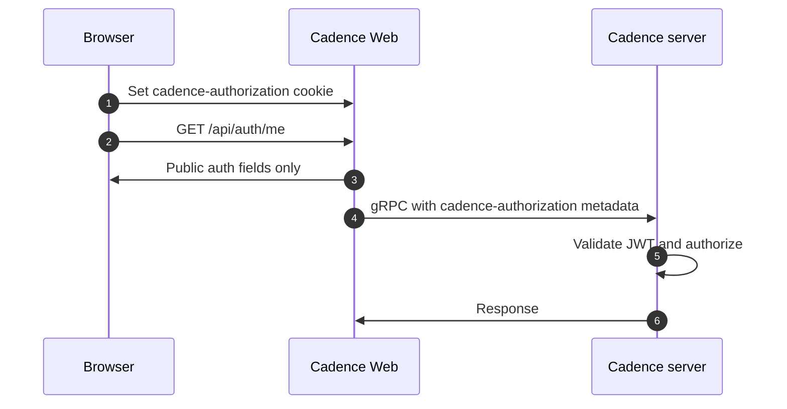

# Cadence Web authentication
This document explains how authorization works in the [Cadence](https://github.com/cadence-workflow/cadence) backend, how Cadence Web participates in that model, and how operators and developers should configure and use web auth.

For the full design — modules, flows, rationale, security model, customization points, and the backend migration plan — see [`docs/auth-design.md`](./auth-design.md).

---

## 1. Cadence backend authorization (brief)

The Cadence server ([cadence-workflow/cadence](https://github.com/cadence-workflow/cadence)) is the **source of truth** for who may call which APIs and what they may do on each domain. The Web UI does not replace that enforcement; it forwards credentials so the server can validate and authorize every gRPC request.

**JWT-based access:** When JWT authorization is enabled on the cluster, the server validates incoming tokens (signature, expiry, and claim shape per deployment config—often via an OAuth authorizer with a public key or JWKS). Typical claims include a subject (`sub`), optional display name (`name`), optional **group memberships** (`groups` as a string), and an optional **`admin`** flag. An admin claim is usually treated as a bypass for domain-level group checks.

**Domain-level rules.** Domains can carry metadata such as **read** and **write** group lists (for example `READ_GROUPS` / `WRITE_GROUPS`—exact names depend on your Cadence version and config). The server compares the caller’s groups (and admin flag) against that metadata to decide read vs write access for that domain.

**Clients and metadata.** gRPC clients are expected to send the credential the server is configured to accept. Cadence Web sends the raw JWT in gRPC metadata under the key **`cadence-authorization`** so the backend can validate and apply policy the same way as other tooling.

For server-side configuration (keys, authorizer settings, TTLs), use  the [Cadence GitHub repository](https://github.com/cadence-workflow/cadence) (including discussions and release notes for JWT/OAuth authorization).

---

## 2. How auth is implemented in Cadence Web

Cadence Web does **not** implement a full identity provider and does **not** verify JWT signatures. It **decodes** the JWT payload for UX and routing decisions; the Cadence server **validates** the token and enforces authorization.

**Strategy switch.** `CADENCE_WEB_AUTH_STRATEGY` is resolved at server start (`disabled`, `jwt`, or `oidc`). Invalid or missing values behave as `disabled`.

| Strategy | Behavior |
| -------- | -------- |
| `disabled` (default) | No login required. No token is read from the cookie or sent to Cadence. Domain/action resolvers treat the user as having full access for UI purposes. |
| `jwt` | Auth is on: a JWT in the **`cadence-authorization`** HttpOnly cookie is decoded. If valid and not expired, it is attached to gRPC calls. Unauthenticated requests are redirected to **`/login`**; expired or signed-out sessions return there with a `notice` query param. |
| `oidc` | Cadence Web acts as an OIDC relying party (Authorization Code + PKCE). Tokens live in an encrypted (JWE) HttpOnly session cookie; the access token is attached to gRPC calls. Unauthenticated requests are redirected to the identity provider. |

**Temporary web-side logic.** The Cadence backend supports customizable auth providers, so anything the web tier currently decides (claim mapping, group matching, user identity) is an interim default, not a contract. Every such place is marked with a greppable `TODO(cadence-backend):` comment; search for that tag to find all logic that should move behind backend/provider APIs once they exist.

**Cookie and token handling.** The cookie name is `cadence-authorization`. Server-side code (`resolveAuthContext`) reads the cookie, base64-decodes the JWT payload, and validates the shape with a small schema (for example `sub` or `name` required; optional `admin`, `groups`, `exp`). Expired or malformed tokens are dropped; the raw JWT never leaves the server. `GET /api/auth/me` returns the session snapshot only (`authEnabled`, `authStrategy`, `auth.isValidToken`, `auth.expiresAtMs`). User identity is served by `GET /api/auth/user`, and per-domain permissions by `GET /api/domains/[domain]/[cluster]/access` and `.../access-groups`. Each of these endpoints has a default implementation based on token claims and domain metadata; their route handlers are the override points for deployments whose user info or permissions come from external providers, and are designed to be swapped for Cadence backend API calls later.

**Backend calls.** When strategy is `jwt` or `oidc` and a valid token is present, `getGrpcMetadataFromAuth` adds `cadence-authorization: <token>` to gRPC metadata so Cadence can authorize the request.

### OIDC strategy

With `CADENCE_WEB_AUTH_STRATEGY=oidc`, Cadence Web runs a standard OIDC relying-party flow against any spec-compliant provider (Keycloak, Okta, Auth0, Entra ID, ...):

1. **Login** — `GET /api/auth/oidc/login` builds an authorization URL from the provider's discovery metadata (Authorization Code + PKCE + `state` + `nonce`) and redirects to the IdP. The one-time PKCE/state/nonce values live in a short-lived encrypted `cadence-oidc-pending` cookie.
2. **Callback** — `GET /api/auth/oidc/callback` exchanges the code, verifies state/nonce/ID-token signature (via `openid-client`), and stores the tokens in the encrypted (AES-256-GCM JWE, HKDF-derived key) HttpOnly `cadence-oidc-session` cookie. The raw tokens never reach the browser.
3. **Refresh** — when a gRPC call comes back unauthorized, `POST /api/auth/recover` silently refreshes the access token with the stored refresh token, or redirects to login when that fails.
4. **Logout** — `GET /api/auth/oidc/logout` clears the session and, when the provider advertises an `end_session_endpoint` in its discovery metadata, performs OIDC RP-Initiated Logout at the IdP (with `id_token_hint` and `post_logout_redirect_uri`). Providers without one get a local-only logout.

**Session lifetime.** The session expiry follows the access token (`expires_in` from the token response, falling back to a JWT `exp` claim), and refresh extends it — but never past an **absolute ceiling of 24 hours after login** (`OIDC_SESSION_COOKIE_MAX_AGE_SECONDS`). Past the ceiling the user must re-authenticate with the IdP.

**Access token format.** OIDC only guarantees the *ID token* is a JWT; access tokens are provider-controlled and may be opaque. Cadence Web itself handles both (identity/groups are read from the ID token first, session expiry from `expires_in`). However, the token forwarded to the Cadence backend must be something the backend's authorizer can validate — the OSS OAuth authorizer verifies a JWT against configured keys/JWKS, so configure the provider to issue JWT access tokens for this audience (or deploy a backend authorizer that supports introspection).

**Claim mapping.** Groups are read from the `groups` claim and Keycloak-style `realm_access.roles`; membership in `cadence-admin` marks a user admin in the UI. These live in the `DEFAULT_OIDC_CLAIM_MAPPING` code constant (`src/utils/auth/auth.constants.ts`) — intentionally **not** env config, because web-side claim mapping is an interim measure until a Cadence backend API owns authorization data. Forks with different claims edit the constant. Note these claims only drive UI gating; the backend independently authorizes every call.

**Environment variables.**

| Variable | Required | Description |
| -------- | -------- | ----------- |
| `CADENCE_WEB_OIDC_ISSUER` | yes | Issuer URL used for discovery (`/.well-known/openid-configuration`). |
| `CADENCE_WEB_OIDC_CLIENT_ID` | yes | OAuth client ID. |
| `CADENCE_WEB_OIDC_CLIENT_SECRET` | yes | OAuth client secret (confidential client). |
| `CADENCE_WEB_OIDC_REDIRECT_URI` | yes | Absolute URL of `/api/auth/oidc/callback` as registered at the IdP. |
| `CADENCE_WEB_OIDC_SESSION_SECRET` | yes | ≥32 bytes; key material for the session cookie JWE (rotating it invalidates sessions). |
| `CADENCE_WEB_OIDC_SCOPES` | no | Defaults to `openid profile email`; `openid` is always enforced. |
| `CADENCE_WEB_OIDC_ALLOW_INSECURE` | no | Allows an `http:` issuer. Auto-enabled outside production for local development; production requires this explicit opt-in, otherwise startup fails. |

**UI and dynamic config.** The domain access API uses auth context plus domain metadata from the server to compute per-domain access. `WORKFLOW_ACTIONS_ENABLED` / `SCHEDULE_ACTIONS_ENABLED` call that same API so buttons and actions match what the backend will allow. The nav bar and hooks such as `useUserInfo` / `useAuthLifecycle` drive login, logout, and expiry-aware behavior.

**API routes (server).**

- `GET /api/auth/me` — public session snapshot; `Cache-Control: no-store`.
- `GET /api/auth/user` — user display info (id, name, picture); default implementation reads the auth session.
- `GET /api/domains/[domain]/[cluster]/access` — current user's access to the domain (`canRead`, `canWrite`, `isAdmin`, optional `userGroupsModifyUrl`).
- `GET /api/domains/[domain]/[cluster]/access-groups` — the domain's allowed read/write groups (optional `domainGroupsModifyUrl`).
- `POST /api/auth/token` — body `{ "token": "<jwt>" }` (optional `Bearer ` prefix stripped); sets the HttpOnly cookie. Rejects cross-origin requests (login-CSRF guard).
- `DELETE /api/auth/token` — clears the cookie.
- `GET /api/auth/oidc/login` — starts the OIDC flow (`returnTo` query param for post-login redirect).
- `GET /api/auth/oidc/callback` — OIDC redirect URI; establishes the session cookie.
- `GET /api/auth/oidc/logout` — clears the session and performs RP-Initiated Logout when supported (`DELETE` clears cookies without redirecting).
- `POST /api/auth/recover` — strategy-aware session recovery (OIDC refresh-token grant); returns `recovered`, `redirect`, or `noop`.

---

## 3. How to use web auth

### JWT strategy

1. Set `CADENCE_WEB_AUTH_STRATEGY=jwt` (Restart Cadence Web after changing this value if it was running)
2. Obtain a JWT issued for your Cadence environment (same claims your server expects).
3. Open **`/login`** (or follow the redirect when visiting a protected page) and paste your JWT (calls `POST /api/auth/token`).

Logout: use the UI logout control (redirects to `/login`) or `DELETE /api/auth/token`.

### OIDC strategy

1. Register a confidential OAuth client at your identity provider with `CADENCE_WEB_OIDC_REDIRECT_URI` as an allowed redirect URI (and, for RP-Initiated Logout, `/domains` as an allowed post-logout redirect).
2. Set `CADENCE_WEB_AUTH_STRATEGY=oidc` plus the `CADENCE_WEB_OIDC_*` variables (see the table above; `.env.oidc.example` has a working local setup against the docker-compose Keycloak stack).
3. Visiting any protected page redirects to the IdP; after login the session cookie is set and the access token is forwarded to Cadence on every gRPC call.

Logout: use the UI logout control (ends the IdP session too when supported) or `GET /api/auth/oidc/logout`.

### Example JWT claims (illustrative)

```json
{
  "sub": "alice",
  "name": "Alice Example",
  "groups": "readers auditors",
  "admin": false,
  "iat": 1766080179,
  "exp": 1766083779
}
```

`groups` is a **string** (space-separated list). Adjust claims to match your Cadence server configuration.

### Quick verification

1. `GET /api/auth/me` shows `authEnabled: true` and, after login, `auth.isValidToken: true`.
2. Domain pages and workflow actions reflect server permissions (not only frontend guesses).
3. Removing or expiring the token yields unauthenticated or denied behavior consistent with the backend.

---

### End-to-end flow (reference)



Note: 4-5 are not dependant on 2-3 (They can go directly after setting the cookie in step 1)
